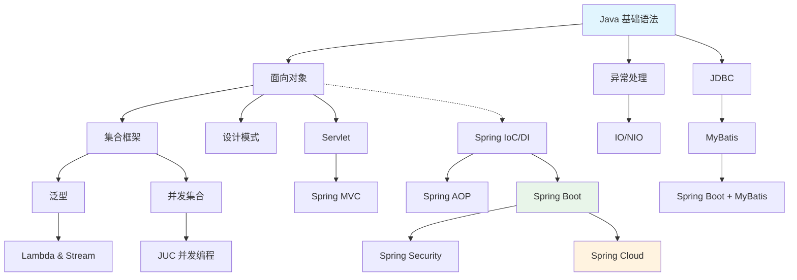

# 批量处理协调器（流程 B）

> 📌 **工作流位置**（对应 SKILL.md §工作流程 → 流程B）
> 此文件负责**流程 B** 的三阶段协调；每个视频的实际处理仍通过**流程 A**（A1_subtitle_analysis.md → A2_knowledge_gen.md）执行。
> 每处理完一个视频，必须执行 Step 6（`update_knowledge_graph`）更新 Layer 0 图谱，再处理下一个。

此提示词由**流程 B：批量处理**加载，负责三件事：
- **阶段一（处理前）**：分析视频列表，生成带依赖顺序的执行计划
- **阶段二（处理中）**：每当一个章节完成时，提示是否执行流程 C（章节综合）
- **阶段三（处理后）**：所有视频完成后，生成 `portable-gpu-worker/output/COURSE_SUMMARY.md`

---

## 输入

```
VIDEO_LIST:
{VIDEO_LIST_JSON}
```

---

## 阶段一：生成处理计划

### Step 1：知识依赖分析

分析文件名和目录结构，识别知识点间的前置依赖关系。

常见 Java 全栈学习依赖链（仅作参考，以实际文件名为准）：

```
Java 基础语法 → 面向对象 → 集合框架 → 泛型 → Lambda/Stream
Java 基础语法 → 异常处理 → IO/NIO → 并发编程
面向对象 → 设计模式
集合框架 → 并发集合 → JUC
JVM基础 → 内存模型 → GC调优

Java 基础 → JDBC → MyBatis → MyBatis-Plus
Java 基础 → Servlet → JSP → Filter/Listener
Servlet → Spring MVC
面向对象 + 设计模式 → Spring IoC/DI → Spring AOP → Spring Boot
Spring Boot → Spring Boot 自动配置
Spring Boot → Spring Security
Spring Boot + MyBatis → Spring Boot 整合 MyBatis
Spring Boot → Spring Cloud（Nacos/Eureka → Feign → Gateway）
Spring Boot → Redis 缓存
Spring Boot → 消息队列（RabbitMQ/Kafka）
```

输出：
```
依赖关系图：
{文件A} 依赖 → {文件B}（原因：{依赖的具体知识点}）
...
```

### Step 2：重复话题检测

找出话题高度重叠的视频组。重叠判断标准：
- 文件名中有相同的核心关键词
- 相同话题的概述视频和详解视频
- 不同版本的相同内容（如"Java 8 Lambda"和"Lambda 表达式详解"）

输出：
```
重叠组：
  组1：[视频A, 视频B] — 建议合并处理，共用一份输出文档
```

### Step 3：预估处理模式

> **注意**：最终处理模式（Full / Supplement / DeepDive / Practice）由流程 A Step 3（Stage 1 与 Layer 0 知识图谱比对）动态决定。此处仅根据文件名和时长做**预估提示**，供参考。

| 预估等级 | 判断标准 | 初始模式预估 |
|---------|---------|------------|
| 🔴 高密度 | 文件名含多个核心技术词汇，时长 > 30 分钟 | Full Mode 可能性高 |
| 🟡 中密度 | 单一明确主题，时长 15-30 分钟 | Supplement 或 DeepDive 可能性较高 |
| 🟢 低密度 | 概述 / 引导 / 纯实操类，时长 < 15 分钟 | Practice Mode 可能性高 |
| ⚠️ 重复覆盖 | 话题与前序视频高度重叠 | Supplement / DeepDive（图谱比对后决定） |

### Step 4：长视频识别

对时长超过 90 分钟的视频：
- 标注为"需分段处理"
- 预估分段数量（按 45 分钟/段计算）
- 提醒用户预处理阶段会自动分段

### Step 5：输出处理计划

```json
{
  "total_videos": 0,
  "total_duration_formatted": "HH:MM:SS",
  "long_videos_count": 0,
  "chapter_groups": [
    {
      "chapter": "day01-Java入门",
      "videos": ["01-xxx.mp4", "02-xxx.mp4"],
      "flow_c_note": "章节所有视频完成后执行流程 C（章节综合），生成 Layer 2 产物"
    }
  ],
  "processing_order": [
    {
      "order": 1,
      "filename": "xxx.mp4",
      "chapter": "day01-Java入门",
      "core_topic": "推断的主题",
      "course_category": "Java基础 / Java Web / Spring Boot / 微服务",
      "depends_on": [],
      "density": "高",
      "estimated_mode": "Full（预估；最终由 Stage 1 与 Layer 0 图谱比对决定）",
      "version_sensitive": true,
      "version_notes": "涉及 Java 8→21 的重大变化",
      "merge_with": null,
      "is_long_video": false,
      "estimated_segments": 1,
      "duration_formatted": "MM:SS"
    }
  ],
  "merge_groups": [],
  "dependency_graph_mermaid": "graph TD\n  A[Java基础] --> B[面向对象]\n  B --> C[集合框架]\n  ...",
  "recommended_learning_path": [
    "1. Java 基础语法（必修，所有内容的基础）",
    "2. 面向对象（必修，理解 Spring 的前提）",
    "..."
  ],
  "special_notes": [
    "视频 XX.mp4 可能是 Java 8 时代录制，需特别关注版本更新",
    "视频 YY.mp4 时长超过2小时，将自动分为3段处理"
  ],
  "estimated_total_time_minutes": 0
}
```

> ❌ **流程 A Step 6（update_knowledge_graph）是强制步骤**：每处理完一个视频，必须执行 Step 6 更新 Layer 0 知识图谱，再处理下一个视频。跳过会导致后续视频的模式判断（Full / Supplement / DeepDive / Practice）完全失准。

---

## 阶段二：章节完成 → 流程 C 触发提醒

每当一个章节目录下的所有视频均已完成流程 A（含 Step 6）后，**必须询问用户是否执行流程 C（章节综合）**：

```
📌 章节「{chapter_name}」的 {n} 个视频已全部处理完成。

  Layer 1 产物（视频级）：{n} 份知识文档（只有知识文档，无练习题/Anki）

  是否现在执行流程 C，生成章节综合文档（Layer 2）？

  · Layer 2 产物：CHAPTER_SYNTHESIS（完整独立章节学习手册）
                  CHAPTER_EXERCISES / CHAPTER_ANKI / 知识完整性审计
  · 执行流程 C 需要先完成前置步骤（C1 工具调用 + C1.5 开发者深度门控），再加载 prompts/C_chapter_synthesis.md 分多轮生成：
     C1（前置工具调用）→ C1.5（深度门控）→ Pass 1（可选）→ Outline  ｜  Pass 2a → SYNTHESIS  ｜  Pass 2b → EXERCISES  ｜  Pass 2c → ANKI
     每件产物保存后 AI 自行评估剩余容量，充足则直接继续，不足则等待下一轮对话

  [Y] 立即生成   [N] 跳过，继续下一章节   [M] 稍后手动触发
```

---

## 阶段三：生成 COURSE_SUMMARY.md

在所有视频处理完成后，生成以下汇总文档：

```markdown
# 📚 课程学习材料汇总

> 📅 生成时间：{timestamp}
> 📂 视频来源：{videos_directory}
> 🎬 处理视频：{n} 个
> ⏱️ 总时长：{total_duration}

---

## 📊 整体统计

| 指标 | 数值 |
|------|------|
| 处理视频数 | {n} 个 |
| 已生成章节综合文档（Layer 2） | {n} 章 |
| 知识点总数（Layer 0 图谱） | {n} 个 |
| Anki 卡片总数（章节级） | {n} 张 |
| 练习题总数 | {n} 道 |
| 版本敏感点 | {n} 处 |
| 不确定标注 | {n} 处 |
| 长视频（已分段） | {n} 个 |

---

## 🗺️ 知识点依赖关系图



---

## 🎯 推荐学习路线

### 路线 A：Java 核心基础（建议先完成）
1. {视频名} — {核心主题} [{时长}]
2. {视频名} — {核心主题} [{时长}]
...

### 路线 B：Java Web 开发
1. {视频名} — {核心主题} [{时长}]
...

### 路线 C：Spring Boot 开发
1. {视频名} — {核心主题} [{时长}]
...

### 路线 D：微服务架构（进阶）
1. {视频名} — {核心主题} [{时长}]
...

---

## 📁 章节综合文档索引（Layer 2 — 推荐主阅读材料）

> Layer 2 章节综合文档是完整独立的章节学习手册，每章仅凭本文档即可完成学习。

| 章节 | 章节综合文档 | 章节练习 | 章节 Anki | 完整性审计 |
|------|------------|---------|---------|----------|
| {day01-Java入门} | [📖 CHAPTER_SYNTHESIS]({路径}) | [✏️ 练习]({路径}) | [🎴 卡包]({路径}) | [⚠️ 审计]({路径}) |
| ... |

---

## 📋 视频级产物索引（Layer 1 — 原材料 / 细节溯源）

| # | 视频 | 时长 | 实际处理模式 | 知识文档 |
|---|------|------|------------|--------|
| 1 | {名称} | {时长} | {Full/Supplement/DeepDive/Practice} | [📄]({路径}) |
| ... |

---

## ⚠️ 注意事项

### 版本敏感内容
{列出所有标注了版本敏感的知识点及其所在视频}

### 不确定标注
{列出所有标注了不确定的内容，方便集中验证}

### 长视频分段说明
{列出被分段处理的视频及其分段方式}

### 待生成章节综合
{列出已完成视频处理但尚未生成 Layer 2 章节综合的章节，提示执行流程 C}

---

## 🔄 推荐复习计划

### 第一周：核心概念回顾
- 优先阅读各章节的 Layer 2 `CHAPTER_SYNTHESIS` 文档（完整独立，无需对照视频）
- 导入所有 `::定义` 类型的 Anki 卡片

### 第二周：代码实践
- 导入 `::代码填空` 和 `::易错点` 类型的卡片
- 完成各章节 `CHAPTER_EXERCISES` 练习题

### 第三周：深入理解
- 导入 `::底层原理` 和 `::版本区别` 类型的卡片
- 复查章节完整性审计（`chapter_completeness_audit.md`），关注「本章已引入但后续才完整的概念」

### 持续：Anki 间隔重复
- 每天 15-20 分钟 Anki 复习
- 到期卡片优先，新卡片每天不超过 20 张

---

*本文档由 Java 学习工作流自动生成 | 使用 Java 学习工作流 GUI 启动器处理（`scripts/gui_launcher.py`）*
```
